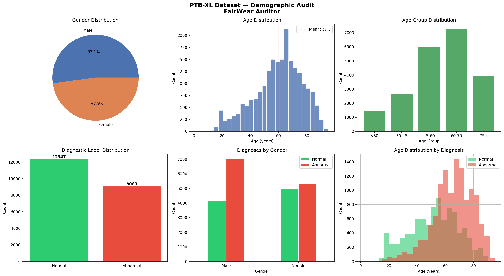
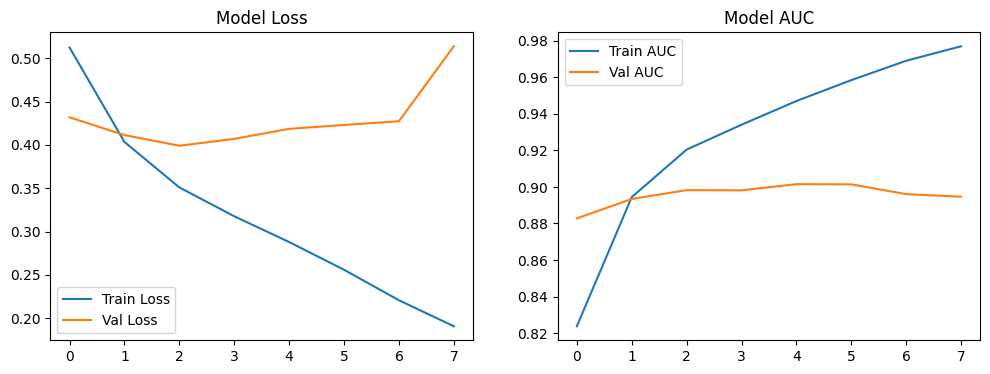

# Reliability and Fairness in Wearable Health AI: Quantifying the Fairness-Utility Trade-off in ECG Analysis


**📄 Read the full paper:** [reports/Reliability_and_Fairness_in_Wearable_AI_Report.pdf](reports/Reliability_and_Fairness_in_Wearable_AI_Report.pdf)

---

## 📌 Overview

As artificial intelligence increasingly powers wearable health monitors, ensuring these models perform **equitably** across diverse demographic groups is a critical clinical safety issue.

This repository contains the code, processed metadata, visualizations, and final report for a comprehensive **bias audit** of an ECG anomaly detection model. The project examines demographic disparities in physiological datasets and evaluates the effectiveness of lightweight fairness mitigation techniques.

---

## 🎯 Key Research Questions

- **RQ1**: Do wearable health AI models perform differently across demographic subgroups (gender, age) on public physiological datasets?
- **RQ2**: Can lightweight mitigation techniques (sample reweighting, augmentation) reduce performance disparities without a significant accuracy trade-off?
- **RQ3**: What are practical guidelines for fairness auditing in wearable AI research?

---

## 📊 Dataset: PTB-XL

The analysis is based on the **PTB-XL** dataset — a large, publicly available electrocardiography (ECG) dataset.

- **Task**: Binary classification (Normal vs. Abnormal ECG)
- **Demographic Variables Audited**: Age (`<60` vs. `≥60`) and Gender
- **Note**: Due to size constraints, the raw 2.3 GB signal data is **not included** in this repository.

---

## ⚙️ Methodology & Architecture

1. **Baseline Model**: 1D-Convolutional Neural Network (1D-CNN) trained on normalized ECG signals.
2. **Fairness Audit**: Detailed evaluation using **False Negative Rate (FNR / Miss Rate)** across demographic subgroups.
3. **Mitigation Strategy**: Subgroup Sample Reweighting based on composite buckets (True Label + Age Group + Gender).
4. **Re-evaluation**: Retraining with sample weights and comparing fairness-utility metrics.

---

## 🚨 Key Findings: The Fairness-Utility Trade-off

The audit revealed a clear **Fairness-Utility Trade-off**. While subgroup reweighting helped reduce some demographic disparities, it led to an overall increase in the False Negative Rate (FNR) across **all** groups — including the majority group.

### 📈 Visualizations

**Demographic Audit**



**Fairness-Utility Trade-off**



---

## 📂 Repository Structure

```plaintext
ECG-Fairness-Utility-Audit/
│
├── data/
│   └── ptbxl_processed_metadata.csv           # Processed metadata with demographics & labels
│
├── notebooks/
│   └── ECG_Bias_Audit_and_Mitigation.ipynb    # Main notebook (preprocessing → training → audit → mitigation)
│
├── reports/
│   └── Reliability_and_Fairness_in_Wearable_AI_Report.pdf   # Final research paper
│
├── visualizations/
│   ├── demographic_tpr_fnr.png
│   └── fairness_utility_tradeoff.png
│
├── requirements.txt
├── LICENSE
└── README.md
```

---

## 🚀 How to Reproduce

### 1. Clone the repository
```bash
git clone https://github.com/DevKumar005/ECG-Fairness-Utility-Audit.git
cd ECG-Fairness-Utility-Audit
```

### 2. Install dependencies
```bash
pip install -r requirements.txt
```

### 3. Configure Kaggle API & Download the PTB-XL Dataset

> **Prerequisites:** You need a Kaggle account and an API key (`kaggle.json`).  
> Follow the [Kaggle API setup guide](https://www.kaggle.com/docs/api#authentication) to place your `kaggle.json` in `~/.kaggle/`.

```bash
kaggle datasets download -d khyeh0719/ptb-xl-dataset --unzip -d data/
```

### 4. Run the Notebook

Open `notebooks/ECG_Bias_Audit_and_Mitigation.ipynb` in Jupyter Notebook, VS Code, or Google Colab and execute the cells sequentially.

---

## 🛠️ Technologies Used

| Category | Libraries & Versions |
|---|---|
| Signal Processing | `wfdb>=4.1.0`, `neurokit2>=0.2.0` |
| Deep Learning | `tensorflow>=2.10.0`, `keras>=2.10.0` |
| Data Analysis | `pandas>=1.5.0`, `scikit-learn>=1.1.0`, `imbalanced-learn>=0.10.0` |
| Visualization | `seaborn>=0.12.0`, `matplotlib>=3.6.0` |
| Utilities | `numpy>=1.23.0`, `tqdm>=4.64.0` |

---

## 📖 Citation

If you use this code or refer to these findings in your own research, please cite this repository:

```bibtex
@misc{ECG-Fairness-Utility-Audit_2026,
  author    = {Dev Kumar},
  title     = {Reliability and Fairness in Wearable Health AI: Quantifying the Fairness-Utility Trade-off in ECG Analysis},
  year      = {2026},
  publisher = {GitHub},
  journal   = {GitHub Repository},
  howpublished = {\url{https://github.com/DevKumar005/ECG-Fairness-Utility-Audit}}
}
```
---

## 📝 Project Context

This project was completed as part of a university term paper on **AI Ethics and Reliability**.

---

## 📄 License

This project is licensed under the **MIT License** — see the [LICENSE](LICENSE) file for details.

---

## 🙋‍♂️ Contributing

Contributions, issues, and feature requests are welcome!  
Feel free to open an issue or submit a pull request if you would like to:

- Add new fairness mitigation techniques
- Extend analysis to other datasets
- Improve model architecture
- Add more fairness metrics

Please read our [Contributing Guide](CONTRIBUTING.md) to get started.

---

⭐ **If you find this work useful, please star the repository!**
